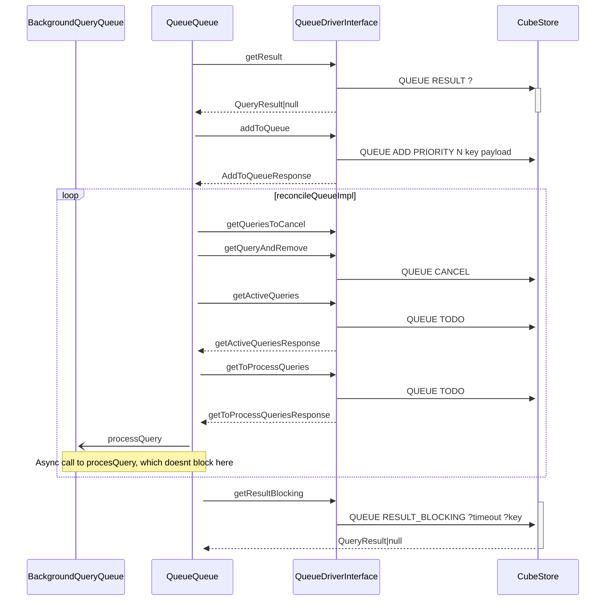
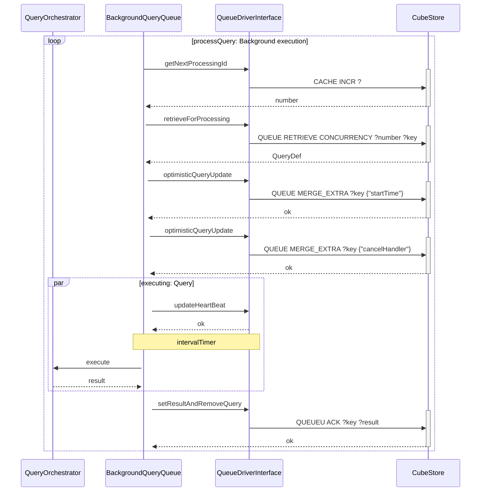

### General queue:

```mermaid
sequenceDiagram
    participant BackgroundQueryQueue
    participant QueueQueue
    participant QueueDriverInterface
    participant CubeStore

    QueueQueue->>QueueDriverInterface: getResult
    QueueDriverInterface->>+CubeStore: QUEUE RESULT ?
    QueueDriverInterface-->>+QueueQueue: QueryResult|null
    deactivate CubeStore

    QueueQueue->>QueueDriverInterface: addToQueue
    QueueDriverInterface->>+CubeStore: QUEUE ADD PRIORITY N key payload
    QueueDriverInterface-->>+QueueQueue: AddToQueueResponse

    loop reconcileQueueImpl
        QueueQueue->>QueueDriverInterface: getQueriesToCancel
        QueueQueue->>QueueDriverInterface: getQueryAndRemove
        QueueDriverInterface->>CubeStore: QUEUE CANCEL

        QueueQueue->>QueueDriverInterface: getActiveQueries
        QueueDriverInterface->>CubeStore: QUEUE TODO
        QueueDriverInterface-->>+QueueQueue: getActiveQueriesResponse

        QueueQueue->>QueueDriverInterface: getToProcessQueries
        QueueDriverInterface->>CubeStore: QUEUE TODO
        QueueDriverInterface-->>+QueueQueue: getToProcessQueriesResponse

        QueueQueue-)+BackgroundQueryQueue: processQuery
        Note over QueueQueue,BackgroundQueryQueue: Async call to procesQuery, which doesnt block here
    end

    QueueQueue->>QueueDriverInterface: getResultBlocking
    activate CubeStore
    QueueDriverInterface->>CubeStore: QUEUE RESULT_BLOCKING ?timeout ?key
    CubeStore-->>+QueueQueue: QueryResult|null
    deactivate CubeStore
```

### Background execution process:

```mermaid
sequenceDiagram
    participant QueryOrchestrator
    participant BackgroundQueryQueue
    participant QueueDriverInterface
    participant CubeStore

    loop processQuery: Background execution
        BackgroundQueryQueue->>QueueDriverInterface: getNextProcessingId
        activate CubeStore
        QueueDriverInterface->>CubeStore: CACHE INCR ?
        CubeStore-->>+BackgroundQueryQueue: number
        deactivate CubeStore

        BackgroundQueryQueue->>QueueDriverInterface: retrieveForProcessing
        activate CubeStore
        QueueDriverInterface->>CubeStore: QUEUE RETRIEVE CONCURRENCY ?number ?key
        CubeStore-->>+BackgroundQueryQueue: QueryDef
        deactivate CubeStore

        BackgroundQueryQueue->>QueueDriverInterface: optimisticQueryUpdate
        activate CubeStore
        QueueDriverInterface->>CubeStore: QUEUE MERGE_EXTRA ?key {"startTime"}
        CubeStore-->>+BackgroundQueryQueue: ok
        deactivate CubeStore

        BackgroundQueryQueue->>QueueDriverInterface: optimisticQueryUpdate
        activate CubeStore
        QueueDriverInterface->>CubeStore: QUEUE MERGE_EXTRA ?key {"cancelHandler"}
        CubeStore-->>+BackgroundQueryQueue: ok
        deactivate CubeStore

        par executing: Query
            BackgroundQueryQueue->>QueueDriverInterface: updateHeartBeat
            QueueDriverInterface-->>BackgroundQueryQueue: ok
            Note over BackgroundQueryQueue,QueueDriverInterface: intervalTimer

            BackgroundQueryQueue->>QueryOrchestrator: execute
            QueryOrchestrator-->>BackgroundQueryQueue: result
        end

        BackgroundQueryQueue->>QueueDriverInterface: setResultAndRemoveQuery
        activate CubeStore
        QueueDriverInterface->>CubeStore: QUEUEU ACK ?key ?result
        CubeStore-->>+BackgroundQueryQueue: ok
        deactivate CubeStore
    end
```
